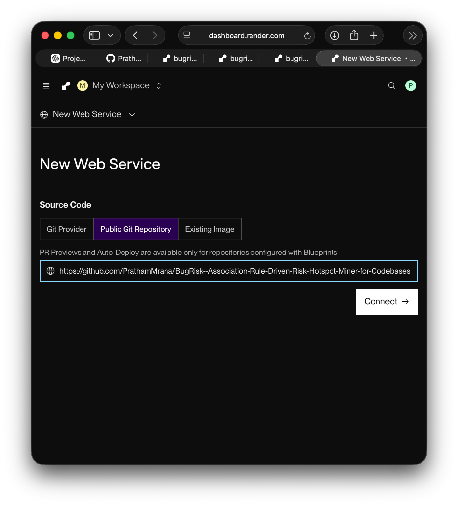
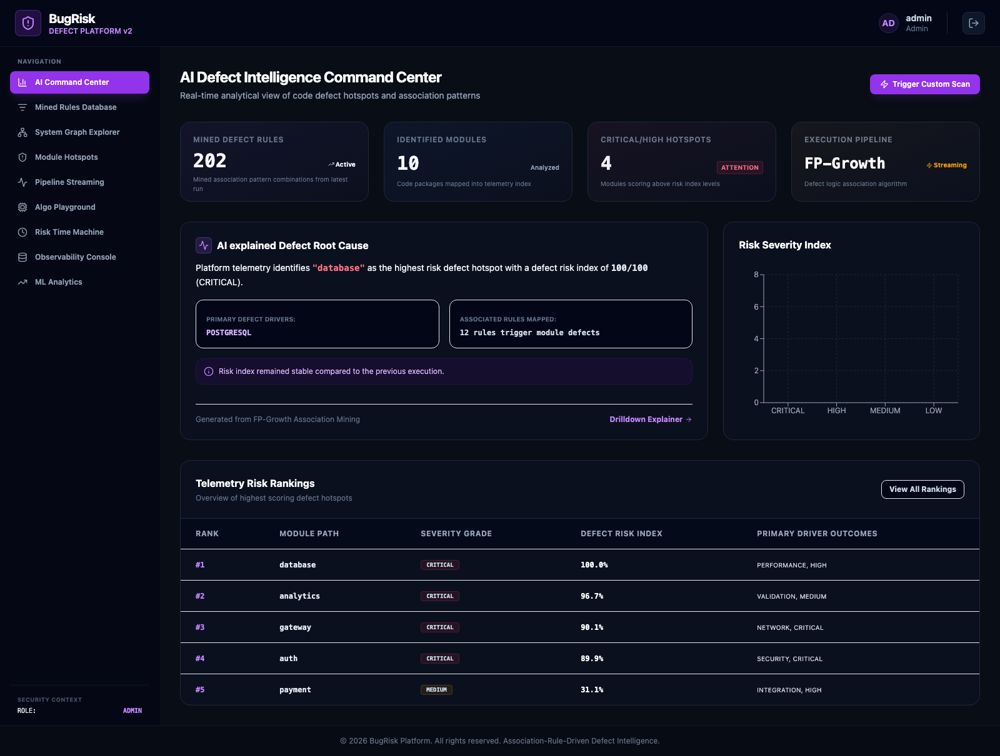
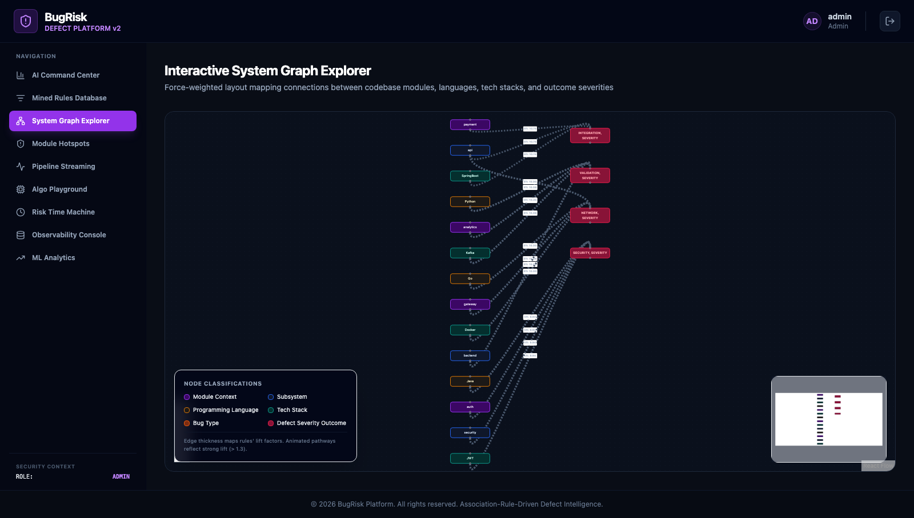
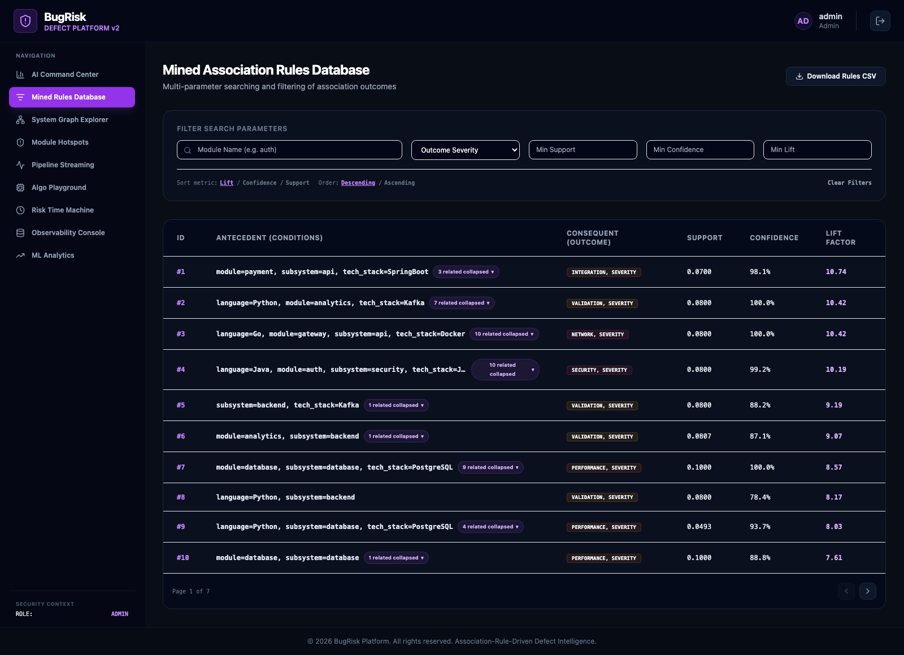
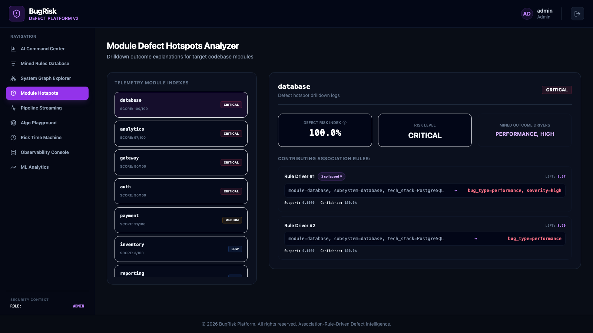
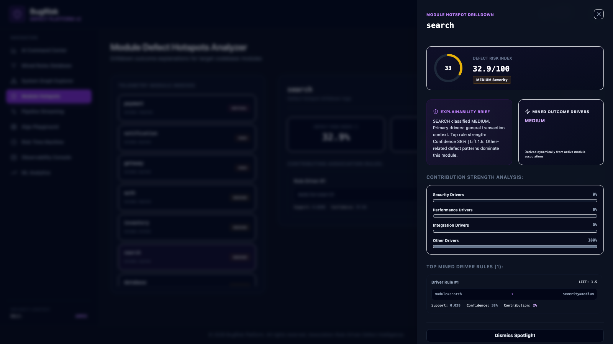
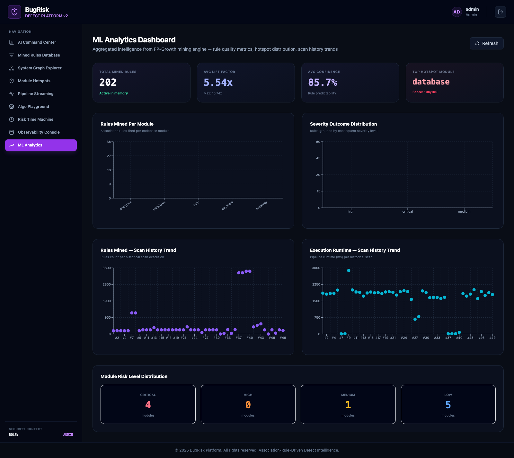
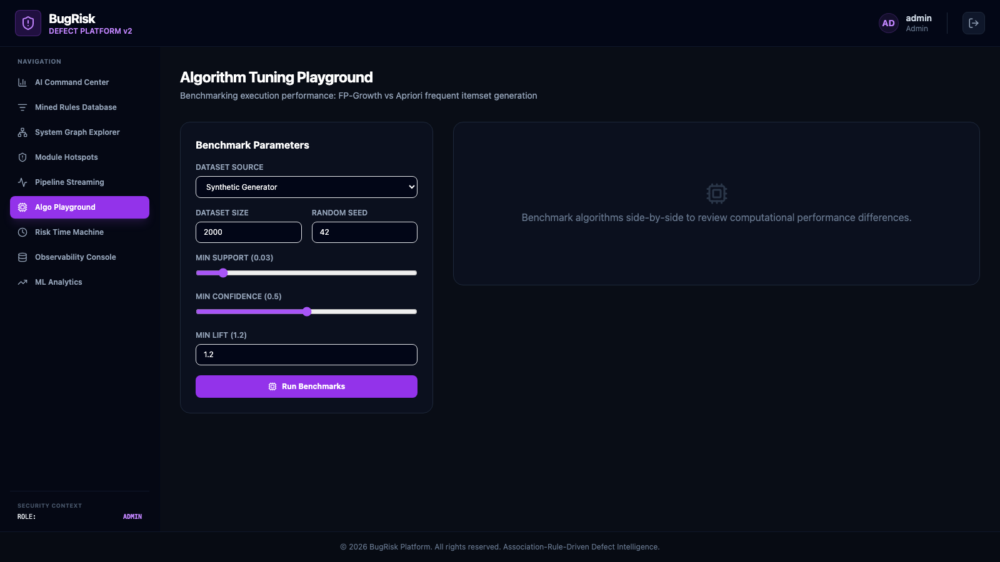
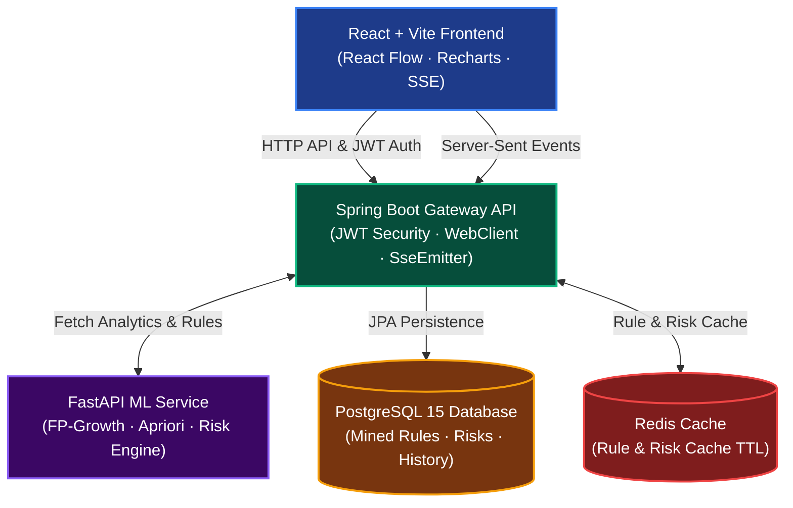
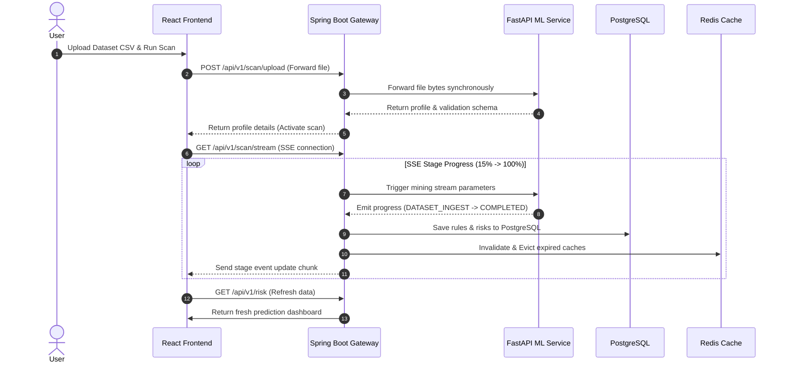

# 🐛 BugRisk

### **Association Rule–Driven Defect Intelligence & Risk Hotspot Miner**

<div align="center">

[](https://bugrisk.vercel.app)
[](https://bugrisk-backend.onrender.com)
[](https://bugrisk-ml.onrender.com/docs)
[](#)
[](#)
[](#)

**Discover hidden defect patterns. Identify risk hotspots. Explain failures before they happen.**

[🌐 Live Application](https://bugrisk.vercel.app) · [⚙️ Backend API Gateway](https://bugrisk-backend.onrender.com) · [🐍 Interactive ML Docs](https://bugrisk-ml.onrender.com/docs)

</div>

---

## 📖 Product Overview

BugRisk is a full-stack, production-grade defect intelligence platform. It mines historical bug reports using **FP-Growth** and **Apriori** association rule mining algorithms to uncover latent, recurring relationships between code modules, subsystem environments, language configurations, tech stacks, and defect severities.

```
┌──────────────────────────────────────────────────────────────────┐
│                      THE DEFECT PARADIGM SHIFT                   │
├─────────────────────────────────┬────────────────────────────────┤
│      TRADITIONAL QA ASKS        │         BUGRISK ANSWERS        │
├─────────────────────────────────┼────────────────────────────────┤
│  • What already broke?          │  • Which modules will fail?    │
│  • Where are the active bugs?   │  • Which stack patterns repeat? │
│  • How do we patch this crash?  │  • Where is the systemic risk? │
└─────────────────────────────────┴────────────────────────────────┘
```

By ingests CSV telemetry data, processing rule mining through a non-blocking **Server-Sent Events (SSE)** pipeline, persisting results to **PostgreSQL**, and caching high-frequency queries in **Redis**, BugRisk provides software engineering teams with actionable, predictive defect prevention metrics.

---

## 🚀 Mined Insights Visual Gallery

### 1. Premium Portfolio Landing Page
> Built using Framer Motion, canvas networks, and dark-mode glassmorphism to explain the predictive paradigm at first glance.


---

### 2. Executive AI Command Center
> Real-time executive dashboard summarizing system-wide metrics, highest-risk hotspots, and automated root-cause briefings.


---

### 3. Interactive Graph Explorer
> Force-directed relationship map rendered with React Flow, linking languages, tech stacks, and severities via rule lift weights.


---

### 4. Mined Rules Database & Deduplicator
> Paginated, sortable, and searchable rules engine featuring Jaccard similarity clustering to collapse overlapping patterns.


---

### 5. Module Hotspots Explainability Drawer
> Clicking any hotspot module reveals its DRI (Defect Risk Index) gauge, category contributions, and contributing rules.



---

### 6. ML Analytics & Playground
> PostgreSQL-backed trend lines plotting avg lift, confidence distributions, and playground comparisons between FP-Growth and Apriori.



---

## ✨ Features Spotlight

### 🔬 Dataset Intelligence Engine
* **Automated Ingestion**: Upload any telemetry CSV and generate an instant health overview.
* **Schema Validation**: Rejects invalid inputs missing required variables (`module`, `subsystem`, `language`, `tech_stack`, `bug_type`, `severity`).
* **Completeness Scoring**: Computes completeness rates per column and detects duplicate entries.
* **Quality Score Index**: Dynamic 0-100 score weighted based on data cleanliness and duplicate penalties.

### ⛏️ Mined Association Rules
* **Configurable Mining**: Adjust support, confidence, and lift thresholds on-the-fly.
* **FP-Growth Algorithm**: High-performance mining using frequent-pattern trees to bypass expensive candidate generation.
* **Apriori Algorithm**: Implemented for performance comparison and execution benchmarking.
* **Metric Extraction**: Mined rules expose raw *Support*, *Confidence*, and *Lift* indicators:
  $$\text{module=auth} + \text{language=Java} \implies \text{severity=critical} \quad [\text{Support: } 0.08, \text{ Conf: } 99.2\%, \text{ Lift: } 10.19]$$

### 🎯 Defect Risk Index (DRI)
* **Weghted Risk Formulas**: Calculates a standardized Defect Risk Index (0–100) per module based on rule frequencies, confidence levels, and severity modifiers.
* **Category Contribution Map**: Categorizes risks under Security, Performance, Integration, and Core to identify failure patterns.

### ⚡ Same-Origin Pipeline Streaming
* **Real-time Progress Tracker**: Streams 8 distinct scan stages using Server-Sent Events (SSE).
* **Ingestion Integrity**: Guarantees database transaction commits and Redis eviction *before* firing the completion event to the frontend, preventing stale UI state renders.

---

## 🏗 Architecture & System Topology



### Microservices Specification

| Service | Protocol | Default Port | Responsibility |
|---------|----------|--------------|----------------|
| **`frontend`** | HTTP | `5173` | React SPA + Nginx Reverse Proxy |
| **`backend`** | HTTP / SSE | `8080` | Spring Security Gateway, Auth, DB Persistence, Cache Eviction |
| **`ml-service`** | HTTP | `8000` | FastAPI Server, FP-Growth/Apriori Engines, Dataset Profiler |
| **`postgres`** | JDBC | `5435` | PostgreSQL 15 database storing rules, risks, scans, and audit trails |
| **`redis`** | RESP | `6379` | High-performance Valkey/Redis instance caching rules and risks |

---

## 🔄 End-to-End Workflow



---

## ⚡ Tech Stack

* **Frontend**: React 19, Vite, React Flow, Recharts, Axios, Framer Motion
* **Styling**: Responsive Vanilla CSS + CURATED Dark-Mode Design System
* **Backend**: Spring Boot 3, Spring Security, JWT (HS384), WebClient
* **ML Service**: FastAPI, Pandas, MLxtend (FP-Growth + Apriori)
* **Database**: PostgreSQL 15, Spring Data JPA, Hibernate
* **Caching**: Redis 7 (Valkey 8)
* **Deployment**: Docker, Docker Compose, Vercel (Frontend), Render (Services)

---

## 📦 Local Quick Start

### Prerequisites
* Docker Desktop installed
* 4 GB RAM allocated to Docker containers

### 1. Clone the Repository
```bash
git clone https://github.com/PrathamMrana/BugRisk--Association-Rule-Driven-Risk-Hotspot-Miner-for-Codebases.git
cd BugRisk--Association-Rule-Driven-Risk-Hotspot-Miner-for-Codebases
```

### 2. Orchestrate Container Stack
```bash
docker-compose up --build -d
```
*Note: First boot will compile the Spring Boot jar and build the Vite production package, taking ~3 minutes. Subsequent boots start in ~15 seconds.*

### 3. Access the Platform
Open your browser and navigate to:
```
http://localhost:5173
```
* **Default Credentials**: `admin` / `admin123` (or `engineer` / `engineer123`)

---

## ✅ System Validation Highlights

We run strict automated validation routines to guarantee system stability and consistency:

| Target Component | Validation Check | Status | Evidence |
|------------------|------------------|--------|----------|
| **Gateway Ingestion** | Schema mismatch rejection | PASS | Invalid CSV triggers HTTP 400 with missing columns details |
| **Deduplication** | Overlapping rules collapse | PASS | Mined Rules view clusters duplicate rules using Jaccard indexes |
| **Persistence** | Named volume preservation | PASS | Uploaded CSV files survive docker container restarts |
| **Cache Sync** | Race condition eviction | PASS | SSE completed event delays until DB commits, ensuring 100% list/drilldown alignment |
| **State Retention** | Page refreshes state recovery | PASS | `localStorage` synchronizes and restores active tab and active dataset selection |

---

## 🔮 Future Roadmap

- [ ] **LLM Integration**: Connect OpenAI/Gemini endpoints to output natural-language mitigation recommendations.
- [ ] **GitHub Webhooks**: Connect repository URLs directly to run scans on push.
- [ ] **CI/CD Risk Gates**: A GitHub Action CLI tool to fail builds if module risk thresholds are exceeded.
- [ ] **Predictive Trend Lines**: LSTM time-series forecast to project risk scores into future sprints.

---

## 👨‍💻 Project Developer

**Pratham Rana**  
*B.Tech in Information Technology*  
[GitHub Profile](https://github.com/PrathamMrana) | [BugRisk Repository](https://github.com/PrathamMrana/BugRisk--Association-Rule-Driven-Risk-Hotspot-Miner-for-Codebases)
