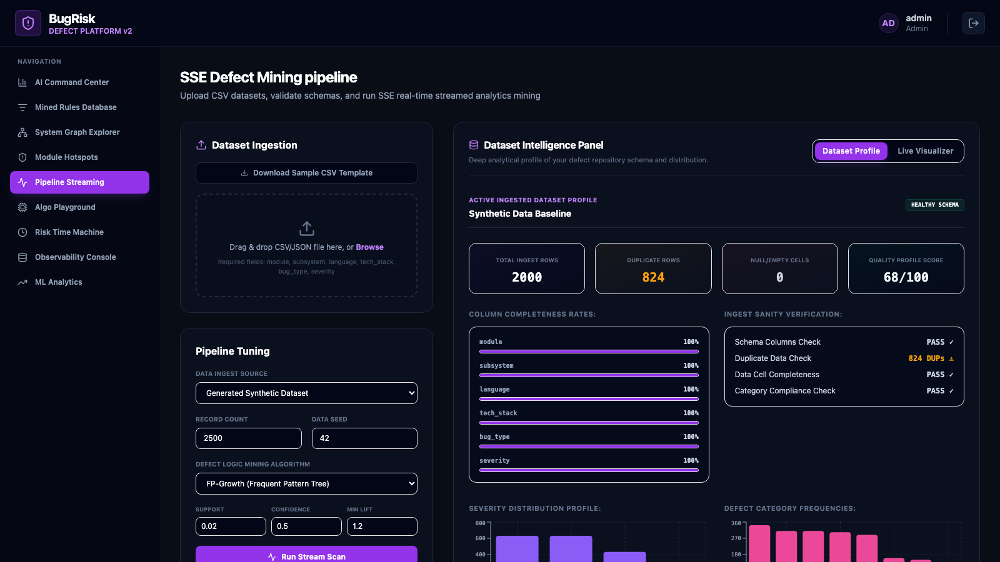

# 🐛 BugRisk
### Association Rule–Driven Risk Hotspot Miner for Software Codebases

<div align="center">


**Discover hidden defect patterns. Identify risk hotspots. Explain failures before they happen.**

[🌐 Live Demo](https://bugrisk-frontend.vercel.app) · [Features](#-features) · [Architecture](#-architecture) · [Quick Start](#-quick-start) · [Screenshots](#-screenshots) · [API Reference](#-api-reference)

</div>

---

## 📖 Overview

BugRisk is a full-stack AI-powered defect intelligence platform that mines historical bug data using **FP-Growth** and **Apriori** association rule mining to uncover hidden relationships between modules, languages, tech stacks, and defect severities.

Traditional defect tracking asks:
> ❌ *What already broke?*

BugRisk answers:
> ✅ *Which modules are statistically likely to fail next?*  
> ✅ *What defect patterns repeat across your codebase?*  
> ✅ *Which tech stack combinations drive the highest severity bugs?*

It ingests CSV defect telemetry, runs real-time streamed FP-Growth mining via Server-Sent Events, persists mined rules to PostgreSQL, and surfaces interactive visualizations across a dark-mode React dashboard.

---

## ✨ Features

### 🔬 Dataset Intelligence Engine
Upload any CSV defect dataset and get an instant health report:
- **Schema validation** — enforces required columns (`module`, `subsystem`, `language`, `tech_stack`, `bug_type`, `severity`)
- **Duplicate detection** with nonlinear quality penalty scoring
- **Missing value analysis** with per-column completeness rates
- **Quality Score** (0–100) derived from a weighted penalty model
- **Distribution charts** for severity, bug type, language, and tech stack

### ⛏️ Association Rule Mining
Two algorithms, configurable thresholds, same streaming pipeline:

| Algorithm | Approach | Best For |
|-----------|----------|----------|
| **FP-Growth** | Frequent-pattern tree, no candidate generation | Large datasets, production use |
| **Apriori** | Candidate generation + pruning | Benchmarking, small datasets |

Each mined rule exposes **Support**, **Confidence**, and **Lift**:
```
module=auth  +  language=Java  +  tech_stack=JWT
        ──────────────────────────────────────▶
        bug_type=security, severity=critical
        [Support: 0.08 | Confidence: 99.2% | Lift: 10.19]
```

### 🎯 Risk Hotspot Detection
Every module gets a **Defect Risk Index (0–100)** calculated from:
- Rule strength weights (`support × confidence × lift`)
- Category contributions (Security / Performance / Integration / Other)
- Normalized ranking across all modules

Risk levels: `LOW` · `MEDIUM` · `HIGH` · `CRITICAL`

### 🤖 AI Command Center
Executive dashboard with:
- Total mined rules · Avg Lift · Avg Confidence
- Highest risk module with natural-language root cause explanation
- Telemetry risk rankings table with primary driver outcomes
- Risk severity distribution chart

### 📋 Mined Rules Database
Interactive rule explorer with:
- Full-text search by module, subsystem, tech stack
- Filter by outcome severity
- Sort by Lift / Confidence / Support
- Jaccard similarity clustering — collapses redundant overlapping rules
- Paginated (7 pages of rules in a typical 2000-row scan)
- CSV export

### 🕸️ System Graph Explorer
ReactFlow force-weighted graph mapping every association relationship:
- **18+ nodes** across Module, Subsystem, Language, Tech Stack, Bug Type, Severity
- Edge thickness = rule lift factor
- Animated pathways for high-lift connections (>1.3)
- Click any node → floating detail panel with rule statistics and outcome distributions

### 🚀 Pipeline Streaming
Real-time scan execution via **Server-Sent Events**:
1. `DATASET_INGEST` → 15%
2. `TRANSACTION_ENCODING` → 35%
3. `FP_TREE_CONSTRUCTION` → 55%
4. `RULE_MINING` → 75%
5. `RISK_SCORING` → 90%
6. `COMPLETED` → 100%

The backend only fires `COMPLETED` **after** the database transaction fully commits — eliminating race conditions between the frontend re-fetch and DB write.

### 🔍 Module Hotspot Drilldown
Click any module to open an explainability drawer with:
- SVG radial gauge (Defect Risk Index)
- Auto-generated natural language explanation:  
  `"DATABASE classified CRITICAL. Primary drivers: PostgreSQL. Confidence 100% | Lift 8.5. Security-related defect patterns dominate this module."`
- Contribution strength analysis by driver category
- Top contributing association rules with metrics

### ⏱️ Risk Time Machine
Historical scan analysis across all 49+ recorded scans:
- Rules mined per scan trend chart
- Execution runtime trend
- Dataset hash fingerprinting (detects dataset changes between scans)
- Tooltip explains parameter spikes: *"Dataset changed: 500 rows → 2000 rows, Support 0.02 → 0.05"*

### 📊 ML Analytics Dashboard
Mining quality metrics from PostgreSQL:
- Avg Confidence · Avg Lift · Max Lift
- Rules-per-module bar chart (top 5 modules)
- Severity outcome distribution
- Module risk level distribution (CRITICAL / HIGH / MEDIUM / LOW)

### 🧪 Algorithm Playground
Benchmark FP-Growth vs Apriori side-by-side:
- Same dataset, same parameters
- Compare: runtime, rules mined, support/confidence distributions
- Results persisted to PostgreSQL scan history

---

## 🏗 Architecture

```
┌─────────────────────────────────────────────┐
│              React + Vite Frontend           │
│   (ReactFlow · Recharts · Axios · SSE)       │
└────────────────────┬────────────────────────┘
                     │  HTTP + SSE  (Nginx reverse proxy)
                     ▼
┌─────────────────────────────────────────────┐
│          Spring Boot Gateway API             │
│   JWT Auth · REST · SseEmitter · WebClient   │
└──────────┬──────────────────────┬───────────┘
           │                      │
           ▼                      ▼
┌──────────────────┐   ┌─────────────────────┐
│  FastAPI ML      │   │    PostgreSQL 15     │
│  Service         │   │                     │
│  FP-Growth       │   │  association_rules  │
│  Apriori         │   │  module_risks       │
│  Risk Engine     │   │  scan_history       │
│  Dataset Profiler│   │  audit_logs         │
└──────────────────┘   └──────────┬──────────┘
                                  │
                        ┌─────────▼──────────┐
                        │    Redis Cache      │
                        │  (rule + risk TTL) │
                        └────────────────────┘
```

**Service responsibilities:**

| Service | Port | Responsibility |
|---------|------|----------------|
| `frontend` | 5173 (→80) | React SPA + Nginx reverse proxy |
| `backend` | 8080 | Auth, orchestration, DB persistence |
| `ml-service` | 8000 | FP-Growth/Apriori mining, risk scoring |
| `postgres` | 5435 | Durable store for rules, risks, history |
| `redis` | 6379 | Cache layer (rules + module risks) |

---

## ⚡ Tech Stack

| Layer | Technology |
|-------|-----------|
| Frontend | React 18, Vite, React Flow, Recharts, Axios |
| Styling | Vanilla CSS + custom design system (dark mode) |
| Backend | Spring Boot 3, Spring Security, JWT, WebClient |
| ML Service | FastAPI, Pandas, MLxtend (FP-Growth + Apriori) |
| Database | PostgreSQL 15, Spring Data JPA, Hibernate |
| Cache | Redis 7 |
| Streaming | Server-Sent Events (SseEmitter) |
| DevOps | Docker, Docker Compose, Nginx |
| Auth | JWT (HS384, role-based: ADMIN / ANALYST) |

---

## 🚀 Quick Start

### Prerequisites
- Docker Desktop ≥ 4.x
- Docker Compose ≥ 2.x
- 4 GB RAM available to Docker

### 1. Clone

```bash
git clone https://github.com/PrathamMrana/BugRisk--Association-Rule-Driven-Risk-Hotspot-Miner-for-Codebases.git
cd BugRisk--Association-Rule-Driven-Risk-Hotspot-Miner-for-Codebases
```

### 2. Build & Run

```bash
docker-compose up --build -d
```

First build takes ~3–5 minutes (Maven dependency download + npm install). Subsequent starts take ~20 seconds.

### 3. Open

```
http://localhost:5173
```

**Default credentials:**
```
Username: admin
Password: admin123
```

### 4. Verify all containers are healthy

```bash
docker ps
```

Expected output:
```
bugrisk-frontend     Up    0.0.0.0:5173->80/tcp
bugrisk-backend      Up    0.0.0.0:8080->8080/tcp
bugrisk-ml-service   Up (healthy)  0.0.0.0:8000->8000/tcp
bugrisk-postgres     Up (healthy)  0.0.0.0:5435->5432/tcp
bugrisk-redis        Up (healthy)  0.0.0.0:6379->6379/tcp
```

### Stopping

```bash
docker-compose down          # Stop (data persisted)
docker-compose down -v       # Stop + wipe all volumes
```

---

## 📥 Dataset Format

Upload a CSV with these exact columns:

```csv
module,subsystem,language,tech_stack,bug_type,severity
auth,security,Java,JWT,security,critical
database,database,Java,PostgreSQL,performance,high
payment,api,TypeScript,SpringBoot,integration,high
```

| Column | Required | Valid Values |
|--------|----------|-------------|
| `module` | ✅ | any string (e.g. `auth`, `payment`) |
| `subsystem` | ✅ | any string (e.g. `api`, `security`) |
| `language` | ✅ | any string (e.g. `Java`, `Python`) |
| `tech_stack` | ✅ | any string (e.g. `PostgreSQL`, `JWT`) |
| `bug_type` | ✅ | any string (e.g. `security`, `performance`) |
| `severity` | ✅ | `critical` · `high` · `medium` · `low` |

> **Note on rule mining:** Association rule mining requires recurring itemset patterns. Datasets with <100 rows or highly unique records may produce few or zero rules at default thresholds (`support=0.03`). Lower support to `0.01` for small datasets.

---

## 📸 Screenshots

### AI Command Center
> Real-time analytical view of mined defect rules, risk rankings, and root cause explanations.


---

### Mined Rules Database
> Interactive explorer for all association rules — filterable, sortable, Jaccard-clustered.


---

### System Graph Explorer
> Force-weighted interactive graph mapping defect relationships across your entire codebase.


---

### Module Hotspots Analyzer
> Per-module risk scores, contributing rules, and AI-generated explanations.


---

### Pipeline Streaming
> Real-time SSE scan execution with Dataset Intelligence profiling.



---

### ML Analytics Dashboard
> Aggregated mining quality metrics — lift, confidence, rule density, scan history trends.


---

### Explainability Drawer
> Click any module to reveal a detailed explainability panel with contribution breakdown.


---

### Algorithm Playground
> Benchmark FP-Growth vs Apriori side-by-side with configurable parameters.


---

## 🔄 Workflow

```
Upload CSV Dataset
       │
       ▼
Schema Validation + Quality Scoring
       │
       ▼
Configure Parameters (Algorithm · Support · Confidence · Lift)
       │
       ▼
Run Stream Scan  ──────────────────────────────────────────────┐
       │                                                       │
       ▼                                              SSE Events to UI
FP-Growth / Apriori Mining (FastAPI ML Service)               │
       │                                                       │
       ▼                                                       │
Risk Score Calculation (0–100 per module)                     │
       │                                                       │
       ▼                                                       │
Persist to PostgreSQL (rules · risks · scan history)  ────────┘
       │
       ▼
Dashboard auto-refreshes:
  ├── AI Command Center (new rankings)
  ├── Rules Database (new rules)
  ├── Graph Explorer (new nodes/edges)
  ├── Module Hotspots (updated scores)
  └── ML Analytics (updated trends)
```

---

## 🌐 API Reference

All endpoints require `Authorization: Bearer <JWT>` except `/auth/login`.

### Auth
| Method | Endpoint | Description |
|--------|----------|-------------|
| `POST` | `/api/v1/auth/login` | Authenticate, receive JWT |

### Scan
| Method | Endpoint | Description |
|--------|----------|-------------|
| `POST` | `/api/v1/scan/upload` | Upload CSV dataset |
| `GET` | `/api/v1/scan/stream` | SSE streaming scan execution |
| `GET` | `/api/v1/scan/history` | All historical scan records |

### Rules & Risks
| Method | Endpoint | Description |
|--------|----------|-------------|
| `GET` | `/api/v1/rules` | Paginated association rules |
| `GET` | `/api/v1/risk` | All module risk scores |
| `GET` | `/api/v1/risk/module/{module}` | Drilldown — single module explainability |

### Analytics
| Method | Endpoint | Description |
|--------|----------|-------------|
| `GET` | `/api/v1/analytics/summary` | Aggregate metrics (rules, lift, confidence) |
| `POST` | `/api/v1/analytics/dataset-profile` | Dataset intelligence profile |

### ML Service (direct, port 8000)
| Method | Endpoint | Description |
|--------|----------|-------------|
| `GET` | `/api/v1/ml/rules` | In-memory rules from last scan |
| `GET` | `/api/v1/ml/dataset-profile` | Dataset profile (source=synthetic\|uploaded) |
| `GET` | `/health` | Health check |

---

## ✅ Validation Highlights

| Test | Result |
|------|--------|
| Dataset upload (valid CSV) | ✅ Pass |
| Schema rejection (missing `severity`) | ✅ Pass |
| Duplicate detection (95%+ duplicates) | ✅ Pass |
| Missing value completeness drop | ✅ Pass |
| SSE race condition (COMPLETED before DB commit) | ✅ Fixed |
| Cross-system consistency (`list score == drilldown score`) | ✅ Verified |
| ML Analytics reads PostgreSQL (not hardcoded) | ✅ Proven (5/7 metrics change between scans) |
| Hard refresh tab persistence (localStorage) | ✅ Pass |
| Docker volume persistence across restarts | ✅ Pass |
| Logout/login data persistence | ✅ Pass |
| Jaccard rule deduplication | ✅ Pass |

---

## 🔮 Roadmap

- [ ] **LLM Root Cause Explanations** — GPT-4/Gemini integration for natural-language defect briefings
- [ ] **GitHub Integration** — Direct repo scanning without CSV export
- [ ] **CI/CD Risk Gates** — Block PRs when target module risk index exceeds threshold
- [ ] **Predictive Failure Forecasting** — LSTM-based time-series on defect trends
- [ ] **Multi-Repository Analysis** — Cross-repo defect correlation
- [ ] **Slack / Teams Alerts** — Push critical hotspot notifications
- [ ] **JIRA Integration** — Auto-tag high-risk tickets

---

## 🗂 Project Structure

```
bugrisk/
├── frontend/               # React + Vite SPA
│   ├── src/App.jsx         # Main application (3700+ lines)
│   ├── nginx.conf          # Reverse proxy + SSE config
│   └── Dockerfile
├── backend/                # Spring Boot 3 Gateway
│   └── src/main/java/com/bugrisk/
│       ├── controller/     # REST endpoints
│       ├── service/        # Business logic + ML gateway
│       ├── entity/         # JPA entities
│       └── repository/     # Spring Data repositories
├── ml-service/             # FastAPI ML Service
│   └── app/
│       ├── api/routes.py   # Mining endpoints
│       ├── services/       # FP-Growth, Apriori, risk engine
│       └── schemas/        # Pydantic DTOs
├── docs/screenshots/       # UI screenshots
└── docker-compose.yml      # Full stack orchestration
```

---

## 👨‍💻 Author

**Pratham Rana**  
B.Tech Information Technology

[](https://github.com/PrathamMrana)
[](https://github.com/PrathamMrana/BugRisk--Association-Rule-Driven-Risk-Hotspot-Miner-for-Codebases)

---

<div align="center">

**If BugRisk helped you or impressed you, drop a ⭐ — it means a lot.**

*Built with Spring Boot · FastAPI · React · PostgreSQL · Docker*

</div>
