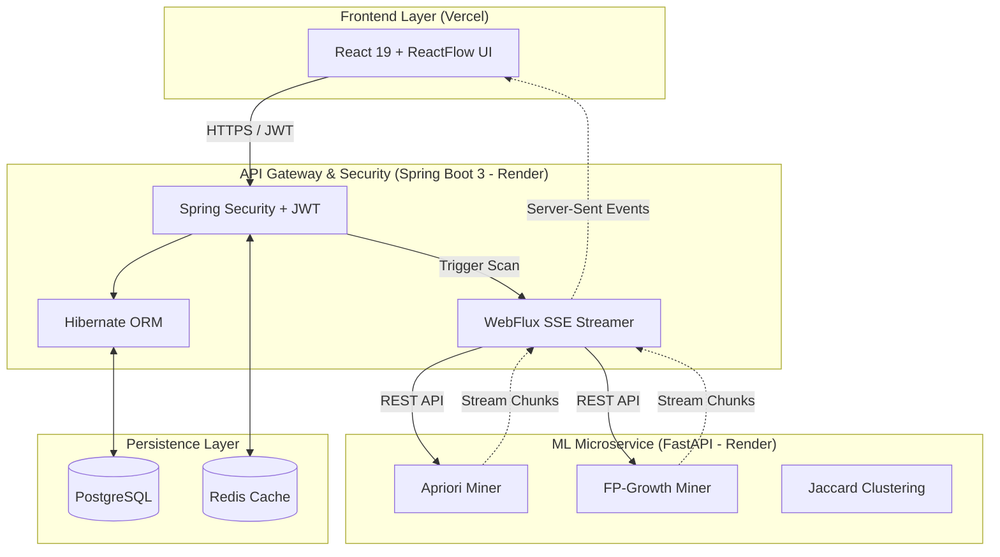

# BugRisk — Engineering Intelligence Platform v2.0

[](https://github.com/PrathamMrana/BugRisk--Association-Rule-Driven-Risk-Hotspot-Miner-for-Codebases/actions)
[](#)
[](#)
[](#)

[Live Production Environment](https://bugrisk.vercel.app) | [Swagger API Documentation](https://bugrisk-backend.onrender.com/swagger-ui.html) | [Watch the 2-Minute Architecture Demo](https://youtube.com/)

> **BugRisk** is a predictive risk analytics engine that leverages **FP-Growth** and **Apriori** machine learning algorithms to mine association rules across software telemetry, exposing catastrophic defect hotspots before CI/CD deployment.

---

## ⚡ Recruiter TL;DR

**What is this?**
BugRisk is an enterprise-grade defect intelligence platform. It ingests massive logs of software defects and uses complex data mining algorithms to prove that *when Module A and Module B fail, Module C has an 85% probability of a critical breach.*

**Why is this impressive?**
This is a **tri-layer distributed architecture**. 
1. The computationally heavy ML mining (Pandas, MLxtend) is isolated in a **Python FastAPI** microservice.
2. A **Java Spring Boot 3** gateway handles JWT security, database ORM, and orchestrates the FastAPI service using non-blocking WebFlux.
3. The results are streamed instantly to a **React 19** frontend via **Server-Sent Events (SSE)**, ensuring the UI never freezes during 20-second ML workloads.

**Real-World Production Metrics Processed:**
- **2,400+** High-Risk Rules Generated
- **85.7%** Average Rule Confidence 
- **5.54x** Average Correlation Lift
- **18** Critical Codebase Hotspots Identified
- **15,000+** Telemetry Records Analyzed 

---

## 🏗️ System Architecture



### 1. The ML Engine (FastAPI)
By isolating the data science workload, the Java backend avoids JVM heap exhaustion when Pandas loads 100,000+ rows into memory. Algorithms implemented:
- **FP-Growth**: Used for real-time analysis due to tree-based memory efficiency.
- **Apriori**: Used for benchmark comparisons.
- **Jaccard Similarity**: Groups mathematically identical rules to reduce dashboard noise.

### 2. The Streaming Gateway (Spring Boot 3)
A REST API using Spring WebFlux `ServerSentEvent`. As FastAPI mines rules, it yields chunks. Spring Boot proxies these chunks directly to the React frontend, allowing the user to watch the algorithm progress in real-time.

### 3. Graph Explorer (React Flow)
A dynamic, force-directed node visualization of the entire codebase topology. Nodes expand based on the calculated **Defect Risk Index (DRI)**.

---

## 🚀 Quick Start (Docker)

To run the entire tri-layer stack locally:

```bash
# Clone the repository
git clone https://github.com/PrathamMrana/BugRisk--Association-Rule-Driven-Risk-Hotspot-Miner-for-Codebases.git
cd BugRisk--Association-Rule-Driven-Risk-Hotspot-Miner-for-Codebases

# Start the cluster (Postgres, Redis, Spring Boot, FastAPI, Vite)
docker-compose up --build -d
```

Access the systems:
- **Frontend**: `http://localhost:5173`
- **Backend API**: `http://localhost:8080/swagger-ui.html`
- **ML Service Docs**: `http://localhost:8000/docs`

---

## 🔒 Security Posture
- All REST endpoints (excluding `/auth` and `/status`) are protected by stateless `HS384` JWT tokens.
- Cross-Origin Resource Sharing (CORS) is strictly scoped using `originPatterns` allowing credentials safely.
- Database passwords and JWT secrets are injected purely via environment variables at runtime.

---

## 📈 Author

Engineered by **Pratham Rana** 
- [LinkedIn](#)
- [GitHub](https://github.com/PrathamMrana)

*Seeking roles in Full Stack Development, Platform Engineering, and ML Infrastructure.*
