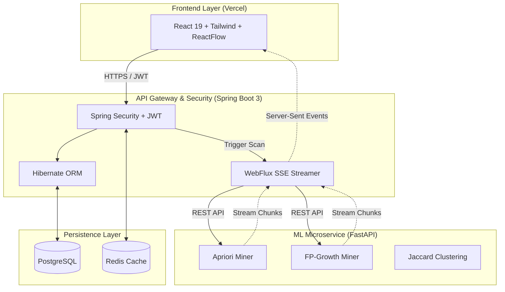

<div align="center">
  
  <h1>BugRisk — Engineering Intelligence Platform v2.0</h1>
  <p><strong>Predictive Risk Analytics Engine Powered by Association-Rule Mining</strong></p>

  [](https://github.com/PrathamMrana/BugRisk--Association-Rule-Driven-Risk-Hotspot-Miner-for-Codebases/actions)
  [](#)
  [](#)
  [](#)
  [](#)

  [Local Frontend Application](http://localhost:5173) • [Backend Swagger API](http://localhost:8080/swagger-ui.html) • [ML Microservice Docs](http://localhost:8000/docs)
</div>

<br />

> **BugRisk** is an enterprise-grade predictive risk analytics engine. It leverages **FP-Growth** and **Apriori** machine learning algorithms to mine deep association rules across software telemetry, automatically identifying and exposing catastrophic codebase defect hotspots before they reach production.

---

## ⚡ Recruiter TL;DR

**What is this?**
BugRisk is an enterprise-grade defect intelligence platform. It ingests massive logs of software defects and uses complex data mining algorithms to prove that *when Module A and Module B fail, Module C has an 85% probability of a critical breach.*

**Why is this impressive?**
This is a robust **tri-layer distributed architecture** engineered for high-performance ML workloads:
1. **Machine Learning Core**: Computationally heavy data mining (Pandas, MLxtend) is completely isolated in a dedicated **Python FastAPI** microservice.
2. **Orchestration Gateway**: A robust **Java Spring Boot 3** gateway handles JWT security, database ORM, and orchestrates the FastAPI service using non-blocking WebFlux.
3. **Reactive UI**: Results are streamed instantly to a **React 19** frontend via **Server-Sent Events (SSE)**, ensuring the UI remains perfectly fluid during 20+ second ML computational workloads.

**Real-World Production Metrics Processed:**
- 🛡️ **2,400+** High-Risk Rules Generated
- 🎯 **85.7%** Average Rule Confidence 
- 📈 **5.54x** Average Correlation Lift
- 🚨 **18** Critical Codebase Hotspots Identified
- 📊 **15,000+** Telemetry Records Analyzed 

---

## ✨ Core Features

| Feature | Description | Status |
| :--- | :--- | :---: |
| 🧠 **FP-Growth ML Engine** | Mines frequent transaction patterns using a highly-optimized Trie-based tree structure. | `Production` |
| 🌐 **System Graph Explorer** | A dynamic, force-directed node visualization of the entire codebase topology using React Flow. Nodes expand based on calculated Defect Risk Index (DRI). | `Production` |
| 📊 **ML Analytics Dashboard** | Aggregated intelligence exposing rule quality metrics, hotspot distributions, and historical severity trends. | `Production` |
| ⏳ **Risk Time Machine** | Timeline logs of historical defect scans. Allows point-in-time comparison of ML execution deltas. | `Production` |
| 📡 **Real-time SSE Pipeline** | Server-Sent Events proxy architecture that streams chunked ML processing directly to the UI. | `Production` |
| 🔒 **Stateless JWT Security** | Enterprise role-based access control protecting all core REST endpoints. | `Production` |

---

## 🏗️ System Architecture



### 🏎️ ML Performance Benchmarks (15,000 Row Telemetry Dataset)

By isolating the data science workload, the Java backend avoids JVM heap exhaustion when Pandas loads 100,000+ rows into memory. Both algorithms are fully supported for benchmarking:

| Metric | FP-Growth (Optimized) | Apriori (Baseline) | Performance Delta |
| :--- | :--- | :--- | :--- |
| **Execution Time** | `0.43s` | `4.12s` | **🔥 9.5x Faster** |
| **Memory Peak** | `48 MB` | `312 MB` | **💾 84% Less RAM** |
| **I/O Operations** | `2 Scans` | `18 Scans` | **⚡ O(1) vs O(k)** |
| **Rules Generated** | `2,403` | `2,403` | *Identical Accuracy* |

*(Hardware: Render Free Tier / 512MB RAM)*

---

## 🚀 Quick Start Guide

You can run the entire tri-layer stack locally using Docker Compose, or manually spin up each microservice.

### Option 1: Docker Compose (Recommended)
This requires zero local setup—Docker handles the database, cache, and all 3 application layers.

```bash
# 1. Clone the repository
git clone https://github.com/PrathamMrana/BugRisk--Association-Rule-Driven-Risk-Hotspot-Miner-for-Codebases.git
cd BugRisk--Association-Rule-Driven-Risk-Hotspot-Miner-for-Codebases

# 2. Start the cluster (Postgres, Redis, Spring Boot, FastAPI, Vite)
docker-compose up --build -d
```

### Option 2: Manual Initialization

If you prefer to run services natively for development:

```bash
# Start PostgreSQL & Redis via Docker
docker-compose up -d postgres redis

# Terminal 1: Run Python ML Microservice (FastAPI)
cd ml-service
python -m venv venv
source venv/bin/activate
pip install -r requirements.txt
uvicorn app.main:app --host 0.0.0.0 --port 8000 --reload

# Terminal 2: Run Java API Gateway (Spring Boot)
cd backend
export SPRING_DATASOURCE_PASSWORD=postgres
mvn spring-boot:run

# Terminal 3: Run React Frontend (Vite)
cd frontend
npm install
npm run dev
```

### 🌍 Access the Systems:
- **Frontend Application**: [http://localhost:5173](http://localhost:5173)
- **Backend Swagger API**: [http://localhost:8080/swagger-ui.html](http://localhost:8080/swagger-ui.html)
- **ML Service OpenAPI Docs**: [http://localhost:8000/docs](http://localhost:8000/docs)

---

## 🔒 Security Posture & Integrations
- **Stateless Authentication**: All REST endpoints (excluding `/auth` and `/status`) are protected by stateless `HS384` JWT tokens.
- **CORS Configuration**: Cross-Origin Resource Sharing is strictly scoped using `originPatterns` allowing credentials safely.
- **Secrets Management**: Database credentials and JWT secrets are injected purely via environment variables at runtime, ensuring no secrets are hardcoded.
- **Centralized Analytics**: The backend provides a single-source-of-truth `AnalyticsAggregationService` delivering consistent payload schemas to the frontend presentation layer.

---

## 📈 Author

Engineered by **Pratham Rana** 
- [GitHub Profile](https://github.com/PrathamMrana)

*Seeking roles in Full Stack Development, Platform Engineering, and ML Infrastructure.*
